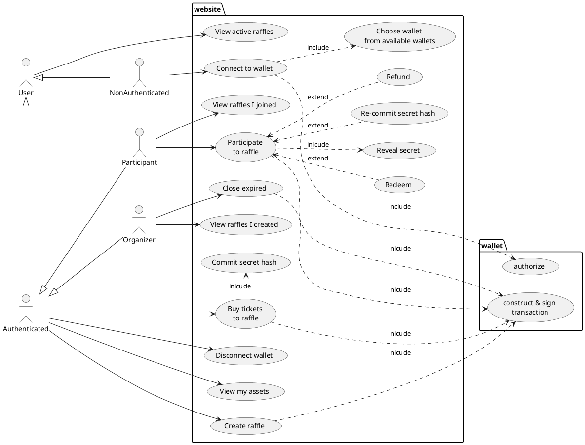

# Project-Sputnik1

```plantuml

@startuml RaffleDApp-UseCases
left to right direction

Actor User as U
Actor NonAuthenticated as NAU
Actor Authenticated as AU
Actor Participant as P
Actor Organizer as O

U  <|- AU
U  <|-- NAU
AU <|--- P
AU <|--- O

package wallet {
    usecase (construct & sign\n transaction) as tx
    usecase (authorize)
}

package website{
    ' Any user
    usecase (Connect to wallet) as connectToWallet
    usecase (Choose wallet \nfrom available wallets) as chooseWallet
    ' Authenticated user
    usecase (Disconnect wallet) as disconnectWallet
    usecase (View my assets) as viewMyAssets
    usecase (Create raffle) as createRaffle
    usecase (View active raffles) as viewActive
    usecase (Buy tickets\n to raffle) as  buyTicket
    ' Organizer
    usecase (View raffles I created) as viewMyRaffles
    usecase (Close expired) as closeExpired
    ' Participants
    usecase (View raffles I joined) as viewJoinedRaffles
    usecase (Participate\n to raffle) as  participate
    usecase (Refund) as refund
    usecase (Redeem) as redeem
    usecase (Reveal secret) as reveal
    usecase (Commit secret hash) as commit
    usecase (Re-commit secret hash) as recommit


    connectToWallet ..> chooseWallet : include
    connectToWallet ...> authorize : include
    createRaffle ...> tx : inlcude
    buyTicket ...> tx : inlcude
    participate ...> tx : inlcude
    closeExpired .> tx : inlcude


    buyTicket .> commit : inlcude

    participate ..> reveal : inlcude
    participate <.. redeem : extend
    participate <.. refund : extend
    participate <.. recommit : extend

}

U -> viewActive

NAU --> connectToWallet

AU -> disconnectWallet
AU -> viewMyAssets
AU -> createRaffle
AU -> buyTicket

O --> viewMyRaffles
O --> closeExpired

P --> viewJoinedRaffles
P --> participate

@enduml
```